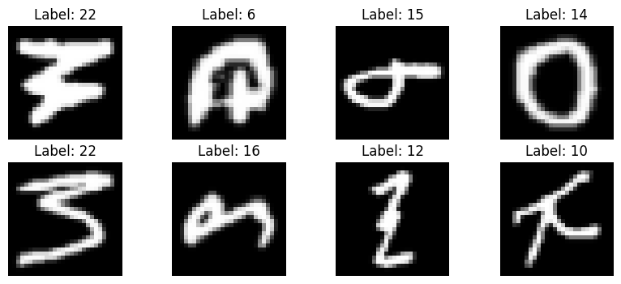
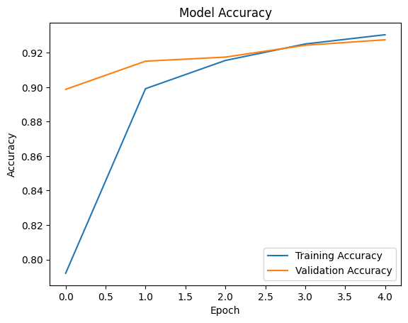
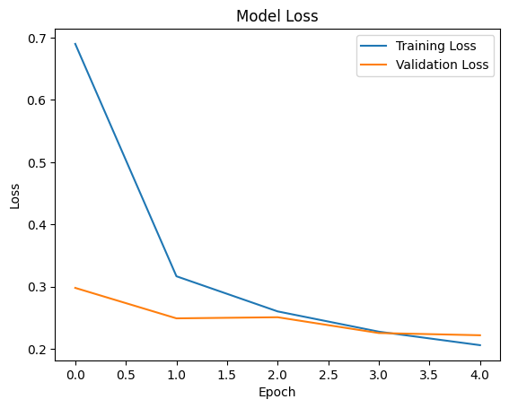
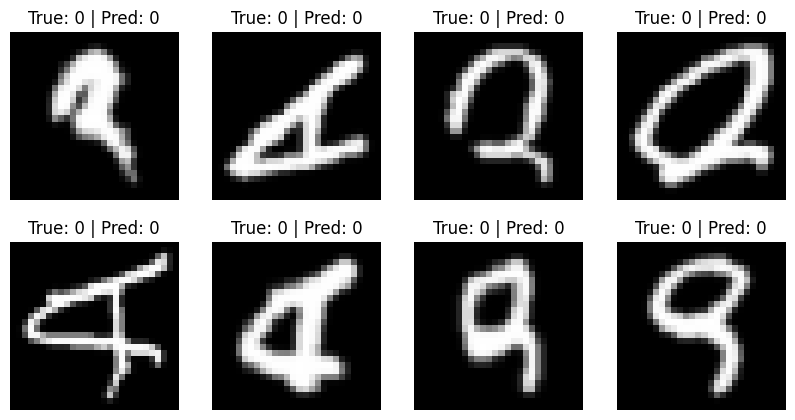

# Handwritten Character Recognition (EMNIST Letters)

This project builds a CNN-based model to recognise handwritten English letters using the EMNIST Letters dataset.  
Model was trained and evaluated in Google Colab using TensorFlow/Keras.

## Project Links
- **Dataset (Kaggle EMNIST):** https://www.kaggle.com/datasets/crawford/emnist
- **Google Colab Notebook:** https://colab.research.google.com/drive/1YEabFvD-PMBtg0sw1wa8MSYYAHkLySjv?usp=sharing

## Results (Quick Summary)
- **Final Test Accuracy:** ~0.9276 (92.76%)
- Errors mainly happen between visually similar handwritten letters.

## Output Visuals

### Dataset Samples

### Training Accuracy

### Training Loss

### Confusion Matrix

### Sample Predictions

